# Building a Market Research Analyzer Agent Using OpenAI Agent Kit

We will be building a market research agent in AgentChatBuilder where we will cover how to integrate MCP servers like Zapier and other tools with your agents. We will also learn how to create widgets and connect them with your agent's output. In the end, we will deploy the agent to production, evaluate its responses, and connect it with ChatKit for the frontend.

## Prerequisites

You must have a premium subscription account.

---

## Step 1: Access the Agent Builder

Go to https://platform.openai.com/agent-builder

## Step 2: Create a New Agent

Click on "Create Agent"

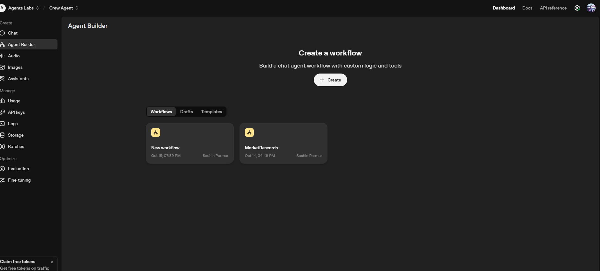

## Step 3: Agent Builder Interface

You will see an interface something like this as shown in the image below:

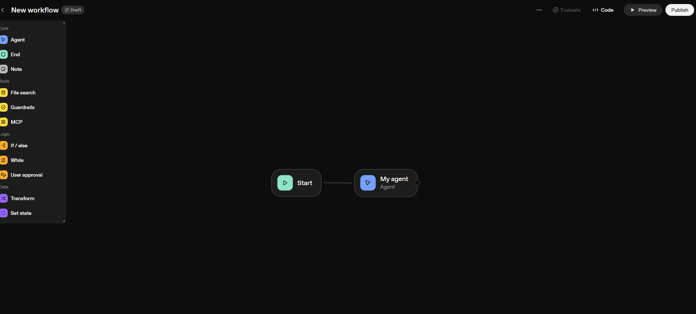

## Step 4: Configure the Agent

1. Click on the agent
2. In the **Instructions** section, provide the prompt that we have provided below

## Prompt 
```

Act as a **senior market research analyst specializing in AI legal tech**. Your task is to **conduct a complete market research analysis** for a **legal tech tool that analyzes contracts for risks and extracts key terms**, based entirely on the given user query — **do not ask the user any follow-up questions**. Instead, use the query context to perform your own research and provide a detailed, evidence-based response.

Organize your research and output according to classic market research conventions, with each section clearly labeled and structured.

### **Deliverables must include:**

* Detailed competitor analysis and landscape overview
* Onboarding/user experience comparison for top competitors
* Pricing and packaging benchmarks
* Feature and integration comparison
* Buyer/user needs assessment & adoption blockers
* Regulatory and enterprise-readiness considerations
* Opportunities and risks synthesis
* End with a 1-page summary and key takeaways

Follow the guidelines and section breakdown below. All claims must include **source URLs and access dates**.
If information is missing, mark it as **"unknown"** and suggest validation steps.
Cite all market and pricing claims.
Do **not** provide legal advice — always include:

> “This research is informational only, not legal advice.”

Format using clear section headings, tables, and concise, neutral, evidence-backed language.
Do **not** use paywalled or scraped data, and always respect source sites’ terms.

---

### **Steps**

1. **Competitor Identification & Landscape Overview**

   * Search for relevant tools (e.g., “AI contract review,” “contract risk analysis,” “clause extraction,” “CLM with AI”).
   * Identify 8–12 credible vendors and summarize the landscape.

2. **Competitor Profiles**
   Include a table with:

   * Target users/segments
   * Core features (risk summary, key-term extraction, clause comparison, suggested rewrites)
   * Integrations (Word, DocuSign, Salesforce, Slack/Teams)
   * Security/compliance posture (SOC 2, GDPR, retention)
   * Pricing & packaging (if public)
   * Differentiators and limitations
   * Source URLs and access dates

3. **Onboarding/User Experience Comparison**

   * Compare onboarding and first-time user experiences for the top 3 competitors.

4. **Pricing & Packaging Benchmark (Top 5 Competitors)**

   * Create a table of free/paid plans, usage limits, and upsell triggers with citations.

5. **Feature & Integration Comparison**

   * Compare competitors’ capabilities in a matrix (term extraction, risk summary, clause comparison, suggested rewrites, Word add-in, CLM integrations, APIs, SSO, audit logs).

6. **Buyer/User Needs & Adoption Blockers**

   * Identify user pain points and adoption barriers.

7. **Regulatory & Enterprise-Readiness Considerations**

   * Summarize IT/legal requirements such as SSO, audit logs, SOC 2, GDPR/CCPA, data residency.

8. **Opportunities & Risks Synthesis**

   * Identify gaps/opportunities and potential risks (hallucinations, misuse, privacy).

9. **Summary & Key Takeaways**

   * Conclude with a 1-page summary of main insights and actionable takeaways.

> This research is informational only, not legal advice.

---

### **Guardrails**

* Do **not** ask the user questions — infer context from the given prompt.
* No data fabrication; label unknowns and recommend validation.
* Cite all sources (URLs + access date).
* Maintain a neutral, concise, professional tone.
* Respect all site terms; use only public data.

---

### **Output Format (Markdown)**

* Use clear section headings and subheadings.
* Include tables for comparisons.
* Provide footnotes or inline citations for all data.
* End with:

> “This research is informational only, not legal advice.”

```
3. In the **Tools** section, add the **Web Search** tool
4. You can also change the model and configure different settings according to your needs

   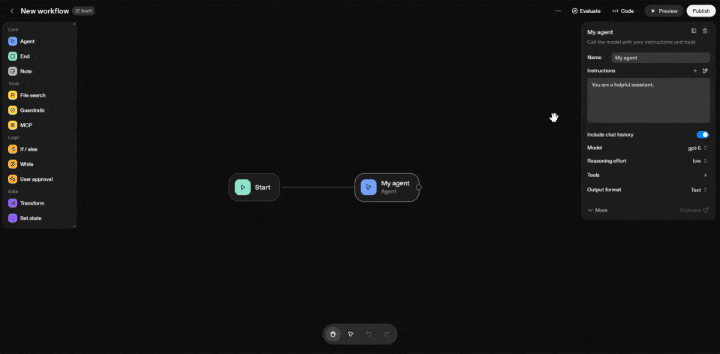

---

## Step 5: Set Variables

1. Add a **Set Variable** action
2. In the **Assign Values** section, add the previous agent output
3. Create a variable which will store your output

   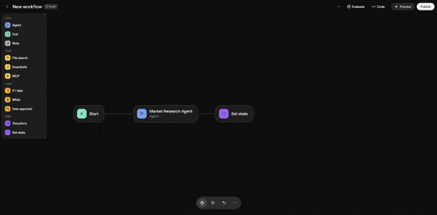

## Step 6: Add User Approval Component

1. Add a **User Approval** component
2. On **Pass** (approval) - add an agent
3. On **Reject** - add an agent

---

## Step 7: Configure the Approve Agent

1. Click on the **Approve Agent**
2. In the **Instructions** section, add the prompt

## Prompt 

**Note**: Replace `{{state.agent_output}}` with the output from your  previous agent.
```
Create a single file named “DOC_Approved” using the content from {{state.agent_output}} generated by the previous agent, then upload this file to Google Drive. Once the upload is successfully completed, retrieve the direct sharing link that allows the user to open or download the file. After the upload, display the result in a markdown-formatted widget showing a clear success message with the file name and a clickable link that redirects directly to the uploaded file. The widget should appear as: “✅ File successfully saved to Google Drive — File Name: DOC_Approved — Google Drive Link: Access DOC_Approved”. If the upload fails, display an appropriate error message instead of the success message.


```
3. Choose your model
4. In the **Tools** section, click on **MCP Server**
5. Choose **Zapier**
6. Click on **Get API Key**

   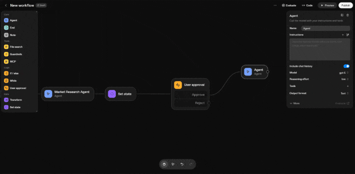

## Step 8: Configure Zapier Integration

1. Zapier will ask you to login first
2. Once you are logged in, it will redirect to the Zapier MCP server tab

   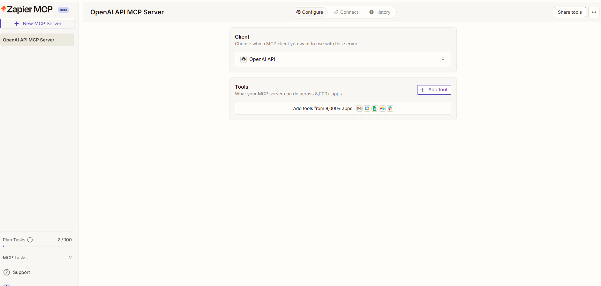

3. Click on **Add Tools**
4. Choose **Google Drive**
5. Select **Create file from text**
6. You can also configure different settings like folder name, file, etc. if you want to do so

   

## Step 9: Connect Zapier MCP Server

1. On the **Connect** tab, copy your API key
2. Come back to the Agent Builder
3. Provide your API key to the Zapier MCP server

   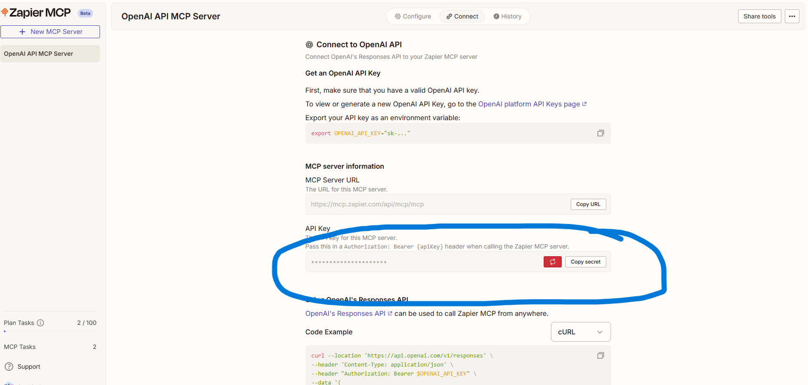

4. Once connected, in the **Approval** section, click on **Never**
5. Click on the **Add** button

   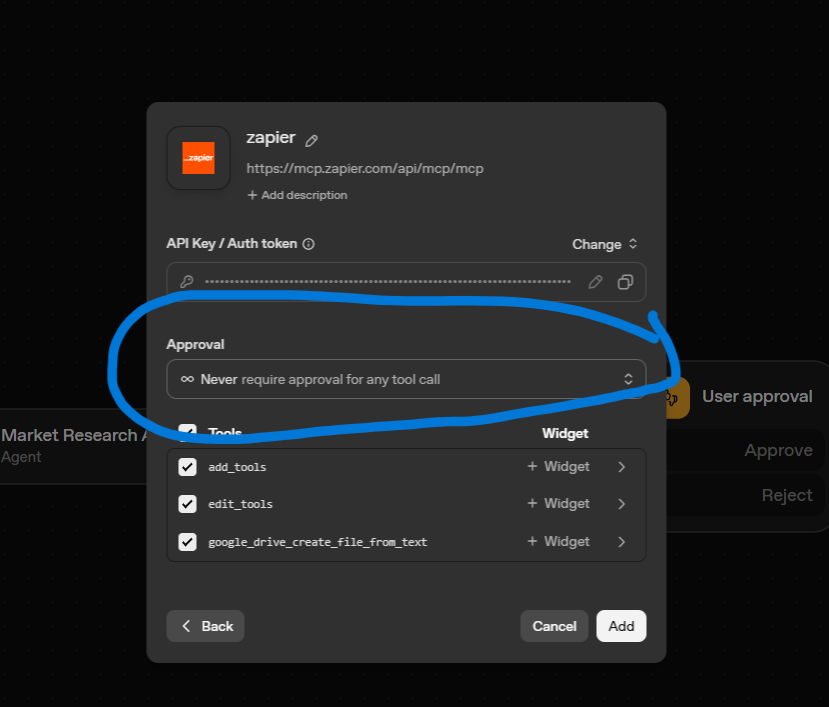

---

## Step 10: Create a Widget

1. In the **Output** section, click on **Widget**
2. Click on **Create Widget**

   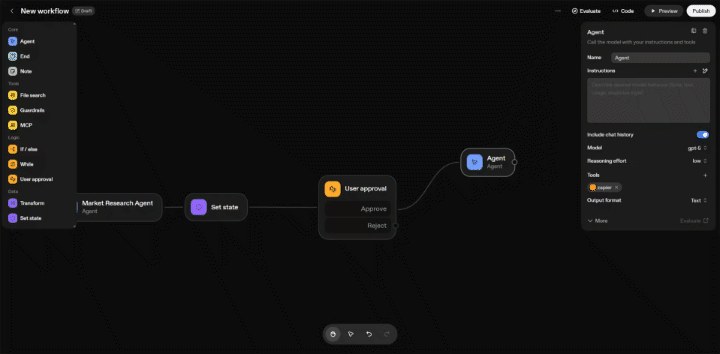

3. You will be redirected to the widget page where you can create a widget using a prompt

   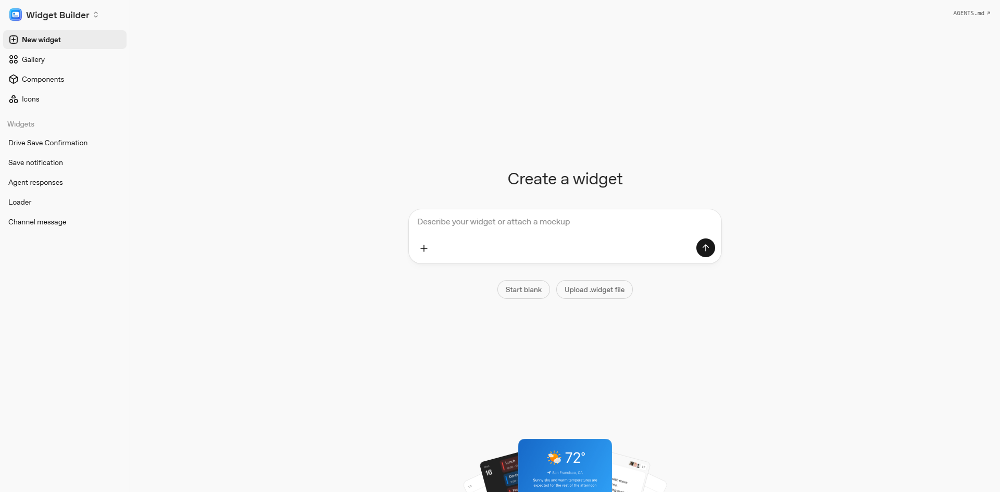

   ### Prompt 
   ```
   Create a widget that confirms a file has been successfully saved to Google Drive. The widget should include a clear success message, display the file name, and provide a clickable link to access the file on Google Drive. 

   ```

4. Add the below prompt in the widget component
5. It will create a widget for you
6. Download that widget

   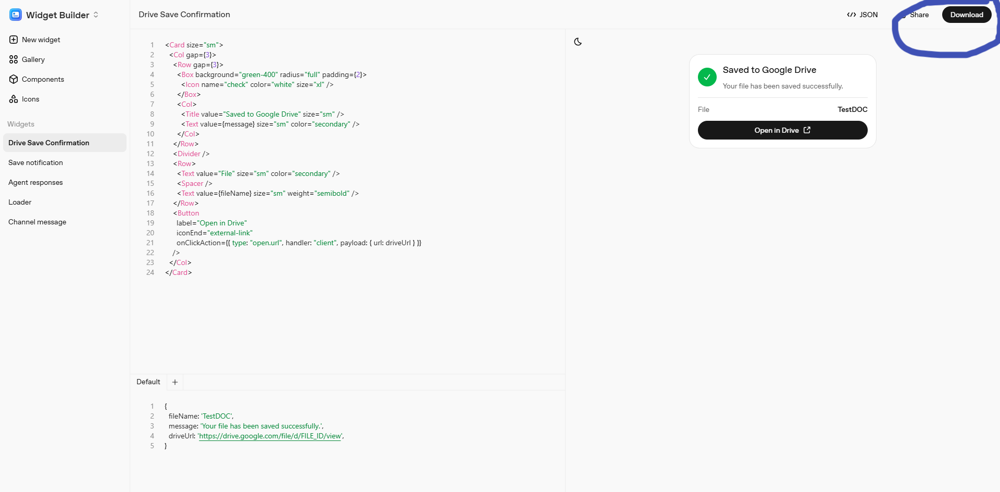

## Step 11: Upload the Widget to Agent

1. Come back to the agent part
2. Upload the widget that you have downloaded

   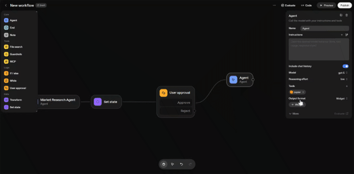

## Step 12: Configure the Reject Agent

1. Copy the approval agent
2. Paste it both same 
3. Replace the instruction with the below prompt

### Prompt 

**Note**: Replace `{{state.agent_output}}` with the output from your  previous agent.

```
Create a single file named “DOC_Rejected” using the content from {{state.agent_output}} generated by the previous agent, then upload this file to Google Drive. Once the upload is successfully completed, retrieve the direct sharing link that allows the user to open or download the file. After the upload, display the result in a markdown-formatted widget showing a clear success message with the file name and a clickable link that redirects directly to the uploaded file. The widget should appear as: “✅ File successfully saved to Google Drive — File Name: DOC_Rejected — Google Drive Link: Access DOC_Rejected”. If the upload fails, display an appropriate error message instead of the success message.

```

   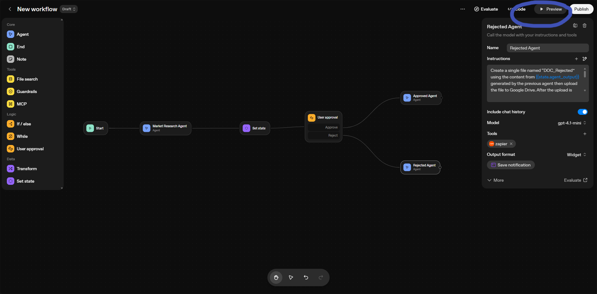

---

## Step 13: Access the Preview Section

1. Go to the **Preview** section

   

2. **Note:** You need to verify your organization to access the preview section
3. Proceed with the verification process first
4. Once verified, you can access the preview section

Now you can see your agent is giving a response. When the user approves the content using Zapier, it will create a file in your Google Drive with the agent response and also provide you the link to access it. You can also see the widget that you have created.

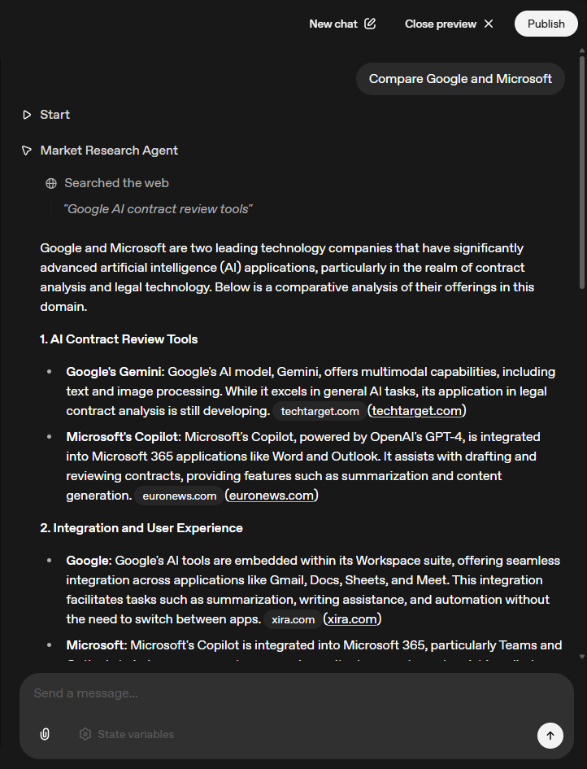

**Widget Output:**

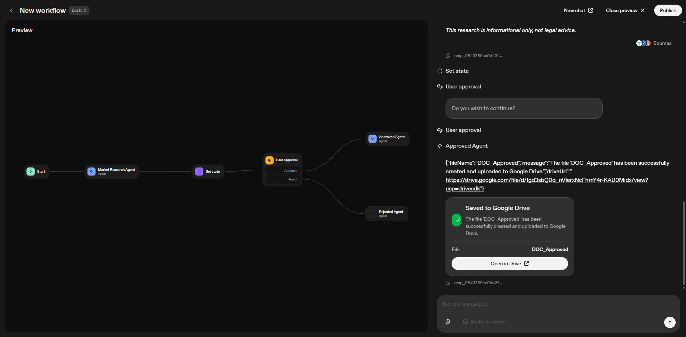

**Google Drive File:**

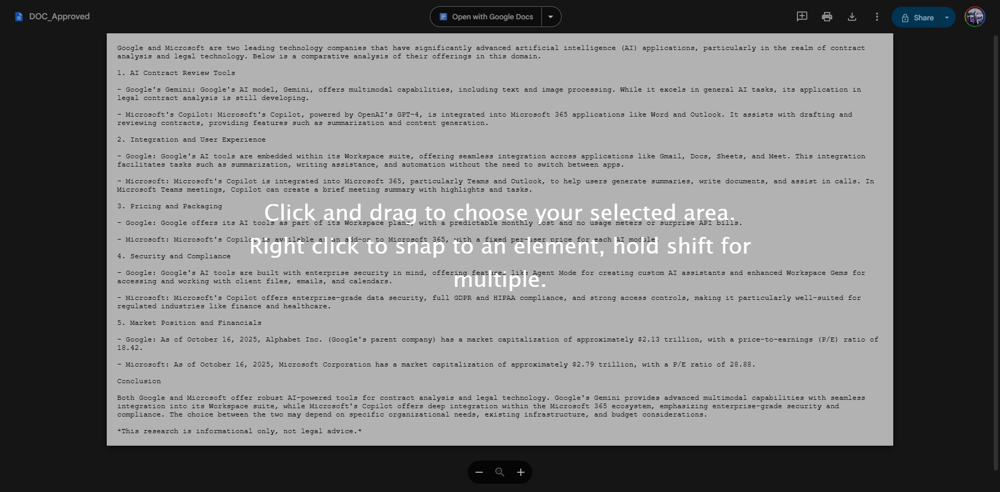

---

## Connect Your Flow with ChatKit for Frontend

### Step 1: Publish Your Workflow and Get Workflow ID

1. In the Agent Builder, click on **Publish** to publish your workflow

   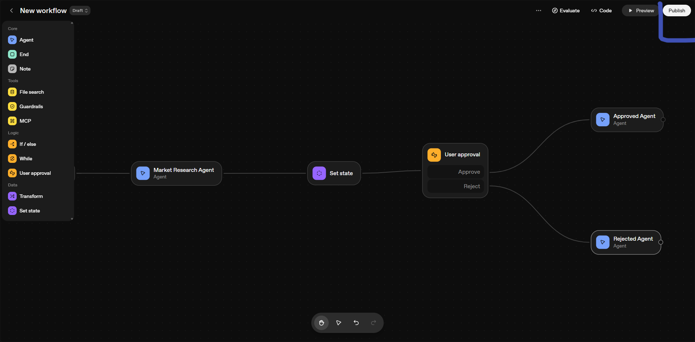

2. Once published, click on the **Code** button

   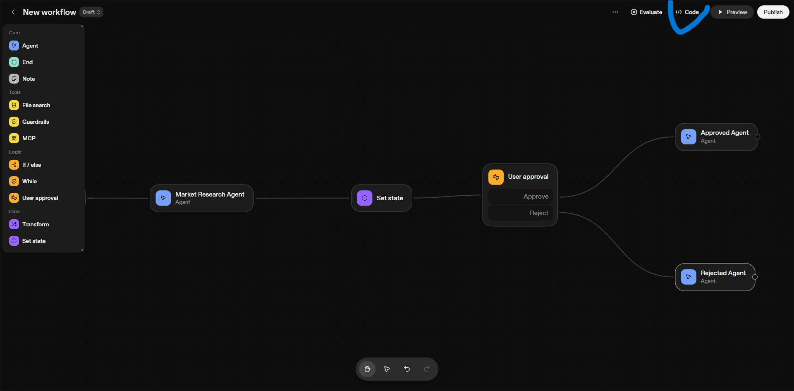

3. Copy the **Workflow ID** that is displayed

   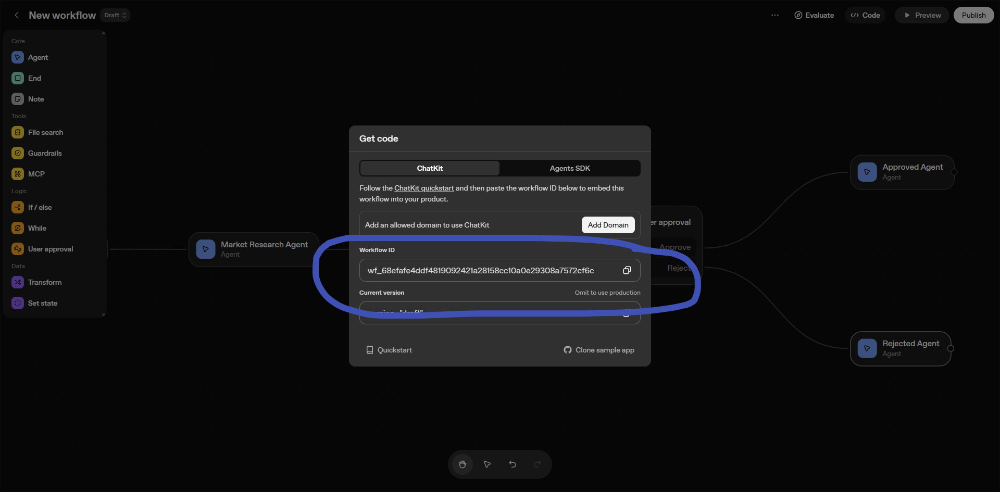

### Step 2: Clone the ChatKit Repository

1. Clone the ChatKit starter template repository using the following command:

   ```bash
   git clone https://github.com/openai/openai-chatkit-starter-app
   ```

2. Open the cloned repository in your code editor (we will be using **Cursor**)

   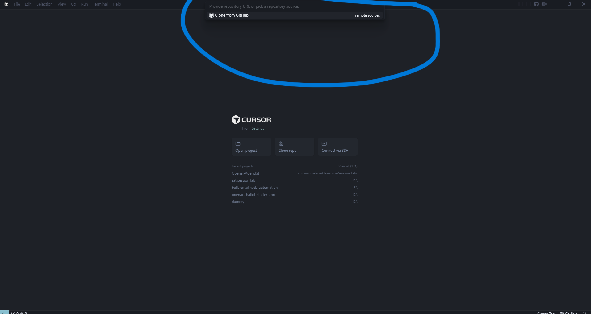

3. Navigate to the project directory

   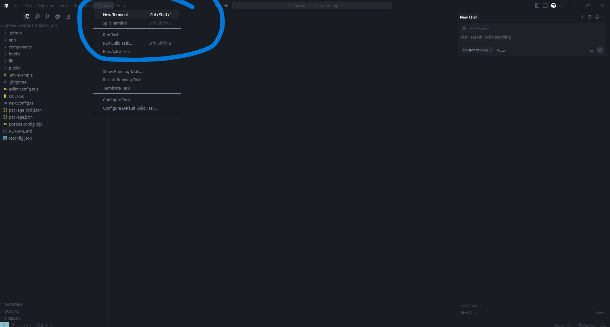

### Step 3: Install Dependencies

Run the following command to install all required dependencies:

```bash
npm install
```

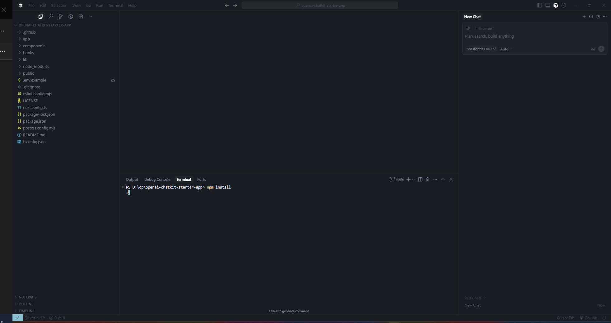

### Step 4: Create Your Environment File

Copy the example file and fill in the required values:

```bash
cp .env.example .env.local
```

You can get your workflow ID from the [Agent Builder](https://platform.openai.com/agent-builder) interface, after clicking "Publish".

### Step 5: Configure ChatKit Credentials

Update `.env.local` with the variables that match your setup:

- **`OPENAI_API_KEY`** — This must be an API key created **within the same org & project as your Agent Builder**. If you already have a different `OPENAI_API_KEY` env variable set in your terminal session, that one will take precedence over the key in `.env.local` (this is how a Next.js app works). So, **please run `unset OPENAI_API_KEY` (`set OPENAI_API_KEY=` for Windows OS) beforehand**.

- **`NEXT_PUBLIC_CHATKIT_WORKFLOW_ID`** — This is the ID of the workflow you created in [Agent Builder](https://platform.openai.com/agent-builder), which starts with `wf_...`

> **Note:** If your workflow is using a model requiring organization verification, such as GPT-5, make sure you verify your organization first. Visit your [organization settings](https://platform.openai.com/settings/organization/general) and click on "Verify Organization".

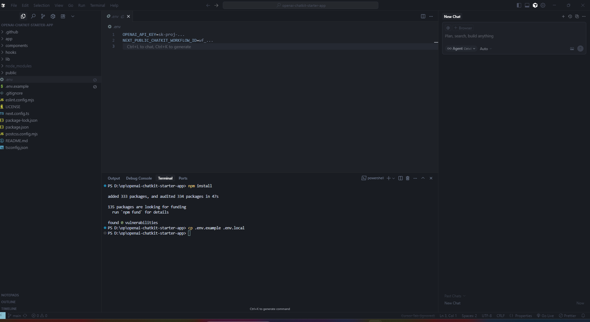

### Step 6: Run the Application

Start the development server:

```bash
npm run dev
```

Visit `http://localhost:3000` and start chatting. Use the prompts on the start screen to verify your workflow connection, then customize the UI or prompt list in `lib/config.ts` and `components/ChatKitPanel.tsx`.

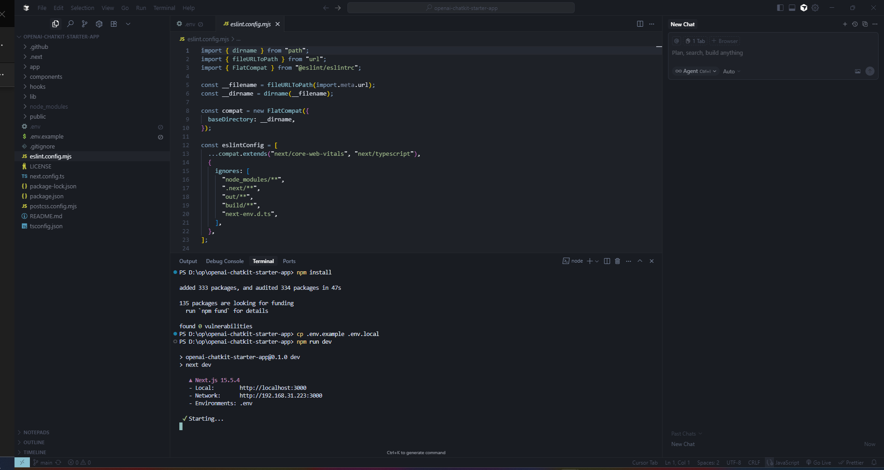

---

## Final Result

Your Market Research Analyzer Agent is now fully integrated with ChatKit and ready to use!

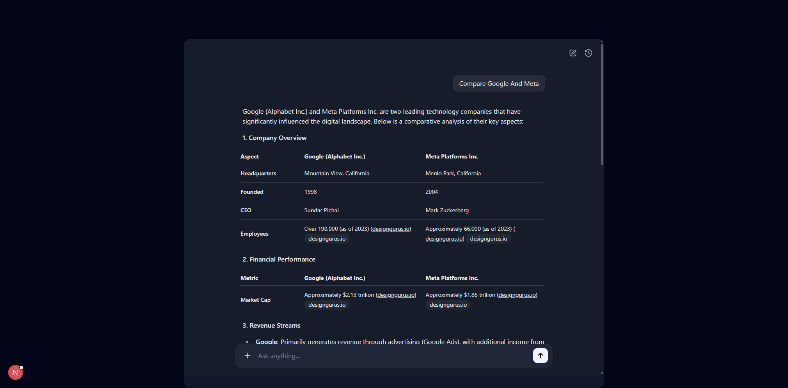

---

## Conclusion

Congratulations! You have successfully:

- ✅ Built a Market Research Analyzer Agent using OpenAI Agent Kit
- ✅ Integrated MCP servers (Zapier) for automation
- ✅ Created custom widgets for enhanced output display
- ✅ Configured Google Drive integration for file storage
- ✅ Deployed your workflow to production
- ✅ Connected your agent with ChatKit for a beautiful frontend interface
- ✅ Created a complete end-to-end solution for market research analysis

Your agent is now live and ready to help users with market research tasks! 🎉
